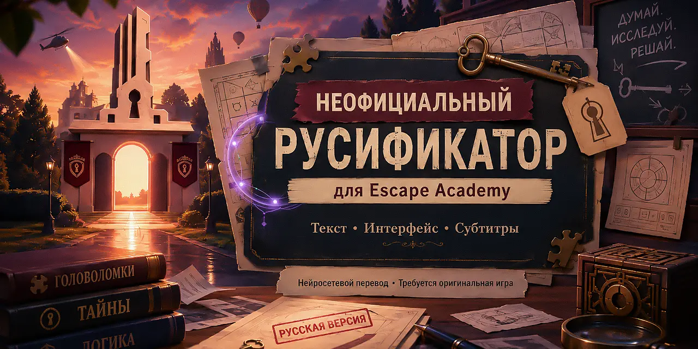
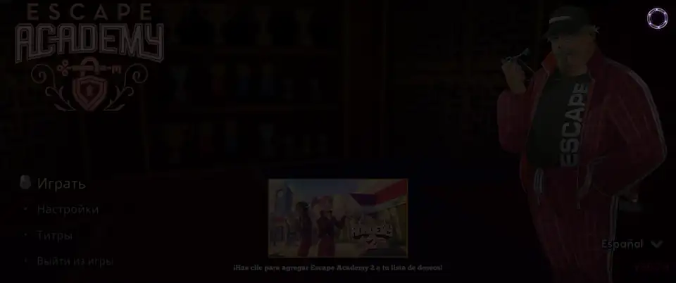

# Русификатор Escape Academy



Неофициальный русский перевод Steam-версии Escape Academy для Windows.
Автономный установщик находит игру, создаёт резервные копии и применяет перевод
непосредственно к локально установленным Unity-архивам. Оригинальные игровые
файлы в репозиторий и установщик не входят.

## Статус перевода

Версия `0.1.2` — тестовый выпуск. Основной текст был переведён локальной
языковой моделью Qwen3.8 27B, затем прошёл автоматические проверки и игровое
тестирование. Это не профессиональная редактура: в поздних комнатах ещё могут
встречаться неточности, пропущенные строки или неудачные формулировки.

Если вы нашли проблему, создайте Issue и приложите название комнаты, скриншот и
текст, который отображается в игре.

## Демонстрация

[](docs/media/EscapeAcademyRus.mp4)

[Открыть трейлер в MP4](docs/media/EscapeAcademyRus.mp4) — 20 секунд, без звука.

Баннер является неофициальной промо-иллюстрацией фанатского проекта, созданной с
использованием генеративной модели. Он не является официальным артом Escape
Academy.

## Совместимость

- Escape Academy `3.0.7.4`
- Steam build ID `20378796`
- Windows x64

После обновления игры контрольные суммы могут измениться. В таком случае не
устанавливайте русификатор до выхода совместимой версии.

## Установка

1. Скачайте `EscapeAcademyRussianInstaller.exe` из раздела **Releases**.
2. Закройте Escape Academy и запустите установщик.
3. Проверьте найденную папку игры или укажите её вручную.
4. Нажмите **Установить** и дождитесь завершения.
5. Запустите игру и выберите **Русский** в настройках языка.

Установщик пока не подписан цифровой подписью, поэтому Windows SmartScreen может
показать предупреждение о неизвестном издателе. Контрольная сумма SHA-256
публикуется рядом с каждым выпуском.

На время установки требуется около 12 ГБ свободного места. Оригиналы сохраняются
в папке `EscapeAcademyRussian` внутри каталога игры. Чтобы вернуть игру в исходное
состояние, снова запустите установщик и нажмите **Удалить русификатор**.

## Как это работает

Русификатор использует внутренний английский языковой слот, добавляет кириллицу в
используемые шрифты и локально пересобирает необходимые игровые ресурсы. В
публичных файлах проекта находятся только русский текст и технические
идентификаторы строк; полный английский сценарий и игровые архивы не
распространяются.

Пока русификатор установлен, пункт **English** заменён пунктом **Русский**. Все
непереведённые текстуры, плакаты, элементы загадок и другие локализованные
ресурсы остаются английскими. Удаление русификатора полностью возвращает
оригинальный английский слот. Установщик также исправляет сбой подсказок без
камеры в поддерживаемой версии игры.

## Сборка из исходников

Требуются Python 3.11 и зависимости из `requirements-build.txt`:

```powershell
python -m pip install -r .\requirements-build.txt
.\build.ps1
```

Готовый установщик и файл `SHA256SUMS.txt` появятся в `dist/`. Для проверки
payload или собранного файла можно выполнить:

```powershell
python .\src\installer_app.py --self-test
.\dist\EscapeAcademyRussianInstaller.exe --self-test
```

## Лицензии и правообладатели

- Код установщика и сборочные сценарии распространяются по лицензии
  [MIT](LICENSE.md).
- Русский текст в `ollama_pipeline/output/` распространяется по лицензии
  [CC BY-NC-SA 4.0](LICENSE-TRANSLATION.md) в той мере, в которой у авторов и
  участников проекта существуют соответствующие права.

Escape Academy и связанные с ней названия и игровые материалы принадлежат их
соответствующим правообладателям. Проект не связан с Coin Crew Games, iam8bit или
издателями Escape Academy и не получил от них официального одобрения. Подробнее —
в [NOTICE.md](NOTICE.md).

---

<p align="center">
  <a href="https://github.com/docwitson">GitHub</a> ·
  <a href="https://boosty.to/docwitson">Boosty</a> ·
  <a href="https://t.me/docwitsonTG">Telegram</a> ·
  <a href="https://www.youtube.com/@docwitson879">YouTube</a> ·
  <a href="https://www.twitch.tv/witskho">Twitch</a>
</p>

<p align="center">
  Если вам нравятся мои проекты и эксперименты, поддержать их развитие можно на <a href="https://boosty.to/docwitson">Boosty</a>.
</p>
